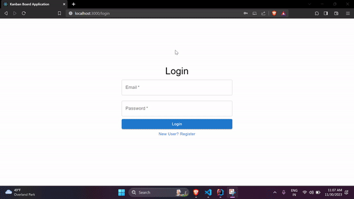

<!--  -->

### Prerequisites

- Docker
- Docker Compose

### Installation

Setting up using docker:

```bash
# Clone the repository
https://github.com/Vamshi5454/Kanban-board.git

# Change into the project directory
cd kanban-board

# Build and start the Docker containers
docker-compose up --build
```

Setting up without docker:

```bash
# Clone the repository
https://github.com/Vamshi5454/Kanban-board.git

# Change into the project directory
cd kanban-board

# Setting and starting the client
cd client
npm install
npm start

# Setting and starting the server
cd server
mvn clean install
mvn spring-boot:run

```
